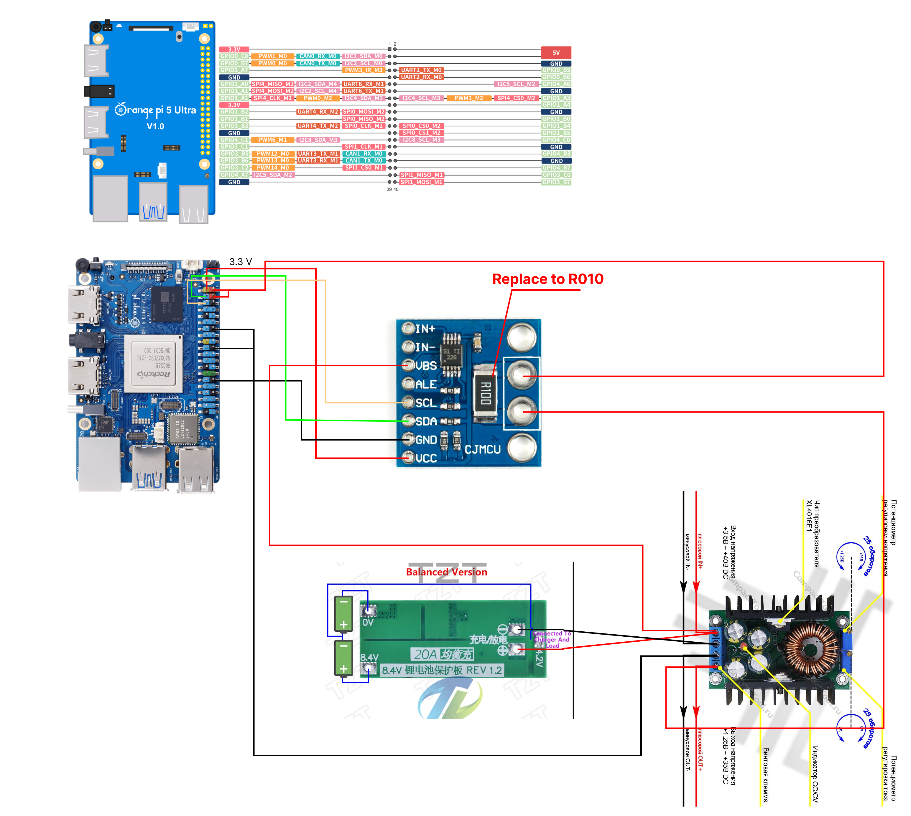

First working version of the driver for charging battery based on ina226

```bash
mkdir driver
cd driver
nano Makefile // paste code
nano ina226-battery.c // paste code
make
cp ina226-battery.ko /lib/modules/6.1.43-rockchip-rk3588/
nano /etc/rc.local 
// paste in end 
// insmod /lib/modules/6.1.43-rockchip-rk3588/ina226-battery
```
To enable the driver to start up, follow these steps:

```bash
echo ina226_battery >> /etc/modules-load.d/modules.conf
cp ina226-battery.ko /lib/modules/6.1.43-rockchip-rk3588/extra/
depmod -a
```
